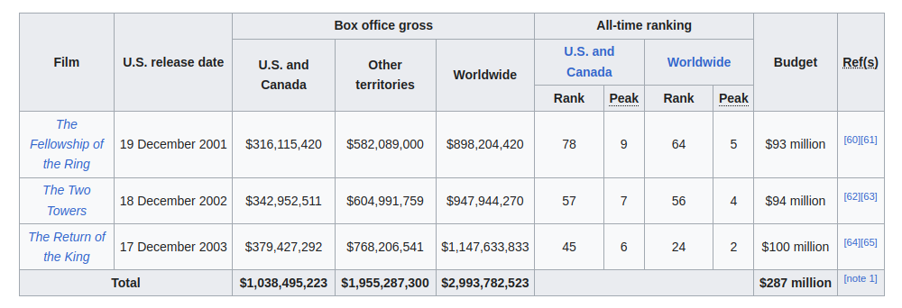

# HTML Tables

A very common task in HTML is structuring tabular data, and it has a number of elements and attributes for just this purpose. Coupled with a little CSS for styling, HTML makes it easy to display tables of information on the web such as your school lesson plan, the timetable at your local swimming pool, or statistics about your favorite dinosaurs or football team. This module takes you through all you need to know about structuring tabular data using HTML.

---

## I. HTML table basics

> A table is a structured set of data made up of rows and columns (**tabular data**). A table allows you to quickly and easily look up values that indicate some kind of connection between different types of data, for example a person and their age, or a day of the week, or the timetable for a local swimming pool.

### A. How does a table work?

The point of a table is that it is **rigid**. Information is easily interpreted by making visual associations between row and column headers. The table below depicts the Box Office Performance of the first three Lord of the Rings film series (live adaptation). If you would want to know how much "The Return of the King" earned in the U.S. and Canada, you can find the answer by associating the relevant row and column headers.

 [^1]

[^1]: [https://en.wikipedia.org/wiki/The_Lord_of_the_Rings_(film_series)#Box_office](https://en.wikipedia.org/wiki/The_Lord_of_the_Rings_(film_series)#Box_office).

### B. When should you NOT use HTML tables?

HTML tables should be used for **tabular data** — this is what they are designed for. Unfortunately, a lot of people used to use HTML tables to lay out web pages, e.g. one row to contain the header, one row to contain the content columns, one row to contain the footer, etc.

In short, using tables for layout rather than using CSS is a bad idea. The main reasons are as follows:

1. **Layout tables reduce accessibility for visually impaired users**: screen readers, used by visually-impared people, interpret the tags that exist in an HTML page and read out the contents to the user. Because tables are not the right tool for layout, and the markup is more complex than with CSS layout techniques, the screen readers' output will be confusing to their users.
2. **Tables produce tag soup**: Table layouts generally involve more complex markup structures than proper layout techniques. This can result in the code being harder to write, maintain, and debug.
3. **Tables are not automatically responsive**: When you use proper layout containers (such as `<header>`, `<section>`, `<article>`, or `<div>`), their width defaults to 100% of their parent element. Tables on the other hand are sized according to their content by default, so extra measures are needed to get table layout styling to effectively work across a variety of devices.

> Deliverable 02: First HTML Table

`C:\Users\raymundoj\Documents\WEBDEVT\deliverables\deliverable02\index.html`

#### Step 01:
1. Start with a standard HTML file (index.html)
2. Use the following CSS rules, by placing the code below on a separate file (`styles.css`)
```
html {
  font-family: sans-serif;
}

table {
  border-collapse: collapse;
  border: 2px solid rgb(200,200,200);
  letter-spacing: 1px;
  font-size: 0.8rem;
}

td, th {
  border: 1px solid rgb(190,190,190);
  padding: 10px 20px;
}

th {
  background-color: rgb(235,235,235);
}

td {
  text-align: center;
}

td.number {
  text-align: right;
}

tr:nth-child(even) td {
  background-color: rgb(250,250,250);
}

tr:nth-child(odd) td {
  background-color: rgb(245,245,245);
}

caption {
  padding: 10px;
}

tfoot {
  font-weight: bold;
}
```
3. On the HTML file, link the `style.css` file by adding a `<link>` within `<head>`

#### Step 02:
1. Use the following structure within the `<body>` element:
```
table
  tr
    td
    td
    td
    td
  tr
    td
    td
    td
    td
```
2. On the first row (`<tr>`):
   1. set the text content of the first `<td>` to "This is the first cell"
   2. set the text content of the second `<td>` to "Second cell, is what they call me"
   3. set the text content of the third `<td>` to "This is the third cell"
   4. set the text content of the fourth `<td>` to "This is the fourth and final cell of the first row"
3. On the second row (`<tr>`):
   1. set the text content of the first `<td>` to "Second row, first cell"
   2. set the text content of the second `<td>` to "Second row, second cell [1, 1]"
   3. set the text content of the third `<td>` to "This is the third cell of the second row"
   4. set the text content of the fourth `<td>` to "I am the cell farthest from the origin"

> Deliverable 03: Table Structure

`C:\Users\raymundoj\Documents\WEBDEVT\deliverables\deliverable03\index.html`

#### Step 01:
1. Start with a standard HTML file (index.html)
2. Copy the previous `styles.css` from  deliverable02 and link it from this `index.html` file (similar to deliverable 02)

#### Step 02:

```
{
  "Indonesia": {
    "head_of_state": "Prabowo Subianto",
    "population": 273753191,
    "area_in_km2": 1904569,
    "capital": "Jakarta"
  },
  "Myanmar": {
    "head_of_state": "Min Aung Hlaing",
    "population": 53798084,
    "area_in_km2": 676578,
    "capital": "Nay Pyi Taw"
  },
  "Thailand": {
    "head_of_state": "Paetongtarn Shinawatra",
    "population": 71601103,
    "area_in_km2": 513120,
    "capital": "Bangkok"
  },
  "Vietnam": {
    "head_of_state": "Lương Cường",
    "population": 97468029,
    "area_in_km2": 331210,
    "capital": "Hanoi"
  },
}
```
1. start with a `<table>` element
2. the `<table>` element should contain 4 children: `<caption>`, `<thead>`, `<tbody>` and `<tfoot>`
3. set the `<caption>`'s text content to "South East Asian Nations"
4. on `<thead>` add a `<tr>` child element 
   1. within `<tr>` add 5 `<th>` child elements
   2. set the 2nd `<th>` element's text content to "Head of State"
   3. set the 3rd `<th>` element's text content to "Population in 2020"
   4. set the 4th `<th>` element's text content to "Total land area in km`<sup>`2`<sup>`"
   5. set the 5th `<th>` element's text content to "Capital City"
5. on `<tbody>` add 4 `<tr>` child elements
   1. for each `<tr>` element within, add 5 `<td>` child elements
   2. On the first `<tr>`, first `<td>` set the text content to "Indonesia"
   3. On the first `<tr>`, second `<td>` set the text content to "Joko Widodo"
   4. On the first `<tr>`, third `<td>` set the text content to "273,753,191"
   5. On the first `<tr>`, fourth `<td>` set the text content to "1,904,569"
   6. On the first `<tr>`, fifth `<td>` set the text content to "Jakarta"
   7. On the second `<tr>`, first `<td>` set the text content to "Myanmar"
   8. On the second `<tr>`, second `<td>` set the text content to "Myint Swe"
   9. On the second `<tr>`, third `<td>` set the text content to "53,798,084"
   10. On the second `<tr>`, fourth `<td>` set the text content to "676,578"
   11. On the second `<tr>`, fifth `<td>` set the text content to "Nay Pyi Taw"
6. on `<tfoot>`, add a `<tr>` child element, then:
   1. within `<tr>`, add 4 `<td>` elements
   2. set the third `<td>`'s `colspan` attribute to 2

#### Step 3: Completing the table
1. Do the same for the remaining South East Asian nations
2. on the `<td>` elements within `<tfoot>`, calculate for the sum for each numeric column (population, and land area)
3. There are a total of 11 South East Asian nations, fill the table with the missing data
4. Adjust the sum calculations in `<tfoot>`
5. Arrange the rows alphabetically by the country names
---
