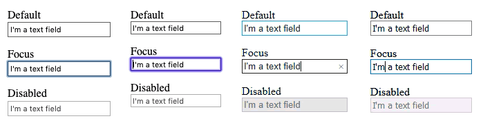
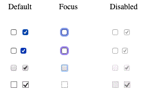
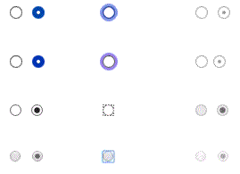
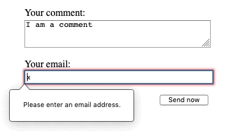
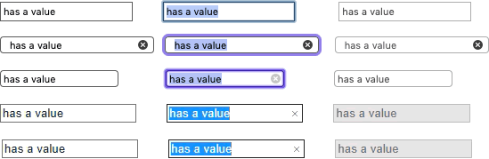
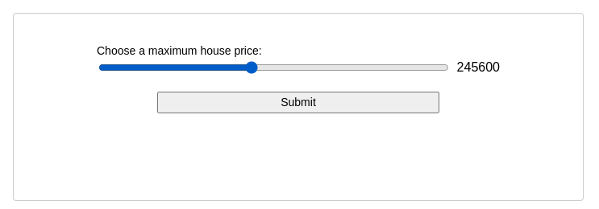
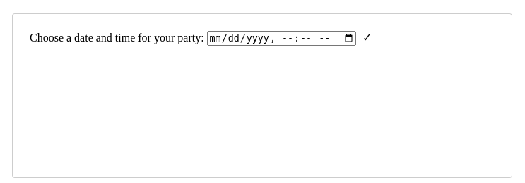
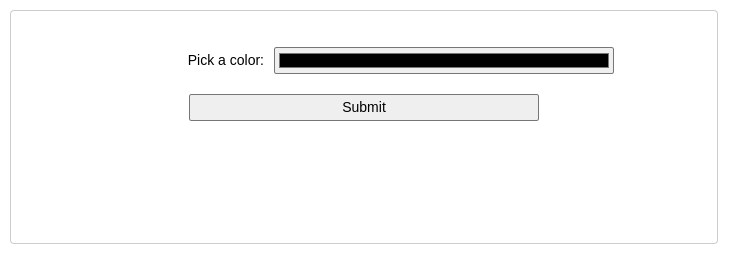
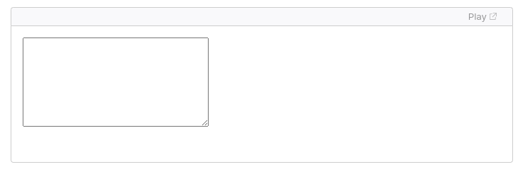
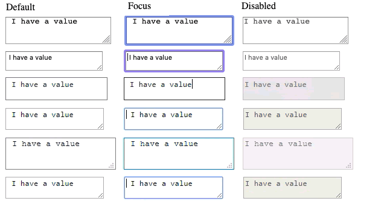

# Web Forms

**Web forms** are a very powerful tool for interacting with users — most commonly they are used for *collecting data from users*, or allowing them to *control a user interface*.

**Web forms** are one of the main points of interaction between a user and a website or application. Forms allow users to enter data, which is generally sent to a web server for processing and storage, or used on the client-side to immediately update the interface in some way.

## I. Introduction

A web form's HTML is made up of one or more **form controls** (sometimes called **widgets**), plus some additional elements to help structure the overall form — they are often referred to as **HTML forms**. The controls can be *single* or multi-line text fields, dropdown boxes, buttons, checkboxes, or radio buttons, and are mostly created using the `<input>` element.

Form controls can also be programmed to enforce specific formats or values to be entered (**form validation**), and paired with text labels that describe their purpose to both sighted and visually impaired users.

---
> Deliverable 05: Simple HTML Form

`C:\Users\raymundoj\Documents\WEBDEVT\week04\deliverable05\simple.html`

```
<!DOCTYPE html>
<html lang="en-US">
  <head>
    <meta charset="utf-8">
    <meta name="viewport" content="width=device-width">
    <title>My test page</title>
  </head>
  <body>
    <p>This is my page</p>
  </body>
</html>
```

#### Step 01: start the `<form>` element

```
<form action="/form-handler" method="post"></form>
```

All forms start with a `<form>` element
  * The `action` attribute defines the location where the form's collected data should be sent when it is submitted
  * The `method` attribute defins which HTTP method to send the data with (`get|post`)  


==Add the `<form>` element within `<body>`==

#### Step 02: `<label>`, `<input>`, and `<textarea>`

```
<form action="/form-handler" method="post">
  <ul>
    <li>
      <label for="name">Name:</label>
      <input type="text" id="name" name="user_name" />
    </li>
    <li>
      <label for="mail">Email:</label>
      <input type="email" id="mail" name="user_email" />
    </li>
    <li>
      <label for="msg">Message:</label>
      <textarea id="msg" name="user_message"></textarea>
    </li>
  </ul>
</form>
```

The data entry portion contains three text fields, each with a corresponding `<label>`
  * The input field for the **name** is a single-line text field
  * The input field for the **email** is a single-line text field that accepts only email addresses
  * The input field for the message is a `<textarea>`; a multiline text field


#### Step 03: `<button>` element

```
<li class="button">
  <button type="submit">Send your message</button>
</li>
```

The `<button>` element also accepts a `type` attribute which accepts one of three values: `submit`, `reset`, `button`

  * A click on a `submit` button sends the form's data to the web page defined by the `action` attribute of the `<form>` elemen
  * A click on a `reset` button resets all the form widgets to their default value immediately. 
  * A click on a `button` button does nothing. This is mostly reserved for JavaScript-enabled functions

==Add this `<li>` as the last child of the `<ul>` element==

#### Step 04: Add basic styling

```
form {
  margin: 0 auto;
  width: 400px;
  padding: 1em;
  border: 1px solid #ccc;
  border-radius: 1em;
}

ul {
  list-style: none;
  padding: 0;
  margin: 0;
}

form li + li {
  margin-top: 1em;
}

label {
  display: inline-block;
  width: 90px;
  text-align: right;
}

input,
textarea {
  font: 1em sans-serif;
  width: 300px;
  box-sizing: border-box;
  border: 1px solid #999;
}

input:focus,
textarea:focus {
  border-color: #000;
}

textarea {
  vertical-align: top;
  height: 5em;
}

.button {
  padding-left: 90px;
}

button {
  margin-left: 0.5em;
}
```

==Add this css as the last child of the `<head>` element==

---

> Deliverable 05: Structuring a Web Form

#### Step 01: initial HTML template

`C:\Users\raymundoj\Documents\WEBDEVT\week04\deliverable05\structure.html`

Copy the blank html file from simple.html

#### Step 02: CSS

`C:\Users\raymundoj\Documents\WEBDEVT\week04\deliverable05\payment-form.css`


```
h1 {
    margin-top: 0;
}

ul {
    margin: 0;
    padding: 0;
    list-style: none;
}

form {
    margin: 0 auto;
    width: 400px;
    padding: 1em;
    border: 1px solid #CCC;
    border-radius: 1em;
}

div+div {
    margin-top: 1em;
}

label span {
    display: inline-block;
    width: 120px;
    text-align: right;
}

input, textarea {
    font: 1em sans-serif;
    width: 250px;
    box-sizing: border-box;
    border: 1px solid #999;
}

input[type=checkbox], input[type=radio] {
    width: auto;
    border: none;
}

input:focus, textarea:focus {
    border-color: #000;
}

textarea {
    vertical-align: top;
    height: 5em;
    resize: vertical;
}

fieldset {
    width: 250px;
    box-sizing: border-box;
    margin-right: 136px;
    border: 1px solid #999;
}

button {
    margin: 20px 0 0 124px;
}

label {
  position: relative;
}
```

Apply the CSS to the HTML by adding the following inside the HTML `<head>`

`<link href="payment-form.css" rel="stylesheet" />`

#### Step 03: the `<form>` element

1. add a `<form>` within the `<body>`, make sure to close it
2. the first child elements of the `<form>` are:
  * `<h1>` with "Payment form" as the content
  * `<p>` with "Required fields are followed by", immediately succeeded by a `<strong>` element, with a child element `<span>`
  * set the `<span>`'s `aria-label` attribute to "required"
  * set the content of `<span>` to "*"

#### Step 04: the first `<section>`

```
section
  h2
  fieldset
    legend
    ul
      li
        label
          input
      li
        label
          input
      li
        label
          input
  p
    label
      span
      strong
        span
    input
  p
    label
      span
      strong
        span
    input
  p
    label
      span
      strong
        span
    input
```

1. From the preceding document structure, write the corresponding html code
2. Set `<h2>`'s content to "Contact information"
3. Set `<legend>`'s content to "Title"
4. Set the first `<label>`'s `for` attribute to "title_1"
5. Set the second `<label>`'s `for` attribute to "title_2"
6. Set the third `<label>`'s `for` attribute to "title_3"
7. Set all `<input>`'s (within `<fieldset>`) `type` attribute to "radio", and `name` attribute to "title"
8. set the first `<input>`'s (within `<fieldset>`) `id` attribute to "title_1", `value` attribute to "FA", and add a sibling text content "Fleet Admiral"
9. set the second `<input>`'s (within `<fieldset>`) `id` attribute to "title_2", `value` attribute to "VA", and add a sibling text content "Vice Admiral"
10. set the third `<input>`'s (within `<fieldset>`) `id` attribute to "title_3", `value` attribute to "RA", and add a sibling text content "Rear Admiral"
11. on the first `<p>`:
    1.  set the `<label>`'s `for` attribute to "name"
    2.  set the `<span>`'s content to "Name: "
    3.  On the `<span>` within `<strong>`:
        1.  set `aria-label` attribute to "required"
        2.  set the content to "*"
    4.  set `<input>`'s `type` attribute to "text", `id` to "name", `name` to "username", then add the stand-alone attribute of "required"
12. on the second `<p>`:
    1.  set the `<label>`'s `for` attribute to "mail"
    2.  set the `<span>`'s content to "Email: "
    3.  On the `<span>` within `<strong>`:
        1.  set `aria-label` attribute to "required"
        2.  set the content to "*"
    4.  set `<input>`'s `type` attribute to "email", `id` to "mail", `name` to "usermail", then add the stand-alone attribute of "required"
13. on the third `<p>`:
    1.  set the `<label>`'s `for` attribute to "pwd"
    2.  set the `<span>`'s content to "Password: "
    3.  On the `<span>` within `<strong>`:
        1.  set `aria-label` attribute to "required"
        2.  set the content to "*"
    4.  set `<input>`'s `type` attribute to "password", `id` to "pwd", `name` to "password", then add the stand-alone attribute of "required"


#### Step 05: The second `<section>`

```
section
  h2
  p
    label
      span
    select
      option
      option
      option
  p
    label
      span
      strong
        span
    input
  p
    label
      span
      strong
        span
    input
```

1. From the preceding document structure, write the corresponding html code
2. Set `<h2>`'s content to "Payment information"
3. on the first `<p>`:
   1. set the `<label>`'s `for` attribute to "card"
   2. set the `<span>`'s content to "Card type: "
   3. set the `<select>`'s `id` attribute to "card", and `name` to "usercard"
   4. set the first `<option>`'s `value` attribute to "visa" and content to "Visa"
   5. set the second `<option>`'s `value` attribute to "mc" and content to "Mastercard"
   6. set the first `<option>`'s `value` attribute to "jcb" and content to "JCB"
4. on the second `<p>`:
   1. set the `<label>`'s `for` attribute to "number"
   2. set the `<span>`'s content to "Card number: "
   3. On the `<span>` within `<strong>`:
        1.  set `aria-label` attribute to "required"
        2.  set the content to "*"
   4. set the `<input>`'s `type` attribute to "tel", `id` to "number", `name` to "cardnumber", then add the stand-alone attribute of "required"
5. on the third `<p>`:
   1. set the `<label>`'s `for` attribute to "expiration"
   2. set the `<span>`'s content to "Expiration date: "
   3. On the `<span>` within `<strong>`:
        1.  set `aria-label` attribute to "required"
        2.  set the content to "*"
   4. for the `<input>`:
        1. set the `type` attribute to "text"
        2. set the `id` attribute to "expiration"
        3. set the `placeholder` attribute to "MM/YY"
        4. set the `pattern` attribute to `^(0[1-9]|1[0-2])\/([0-9]{2})$`
        5. add a stand-alone attribute of "required"

#### Step 06: The third `<section>`

```
section
  p
    button
```

1. set the `<button>`'s `type` attribute to "submit"
2. set the `<button>`'s content to "Validate the payment

The `<fieldset>` element is a convenient way to create groups of widgets that share the same purpose, for styling and semantic purposes. You can label a `<fieldset>` by including a `<legend>` element just below the opening `<fieldset>` tag. The text content of the `<legend>` formally describes the purpose of the `<fieldset>` it is included inside.

---

## II. The different form controls

### A. Basic native form controls

#### Text input fields

Text `<input>` fields are the most basic form widgets.
All basic text controls share some common behaviors:

* They can be marked as `readonly` (the user cannot modify the input value but it is still sent with the rest of the form data) or `disabled` (the input value can't be modified and is never sent with the rest of the form data).
* They can have a `placeholder`; this is the text that appears inside the text input box that should be used to briefly describe the purpose of the box.
* They can be constrained in `size` (the physical size of the box) and `maxlength` (the maximum number of characters that can be entered into the box).
* They can benefit from spell checking (using the `spellcheck` attribute), if the browser supports it.

##### Single line text fields

A single line text field is created using an `<input>` element whose `type` attribute value is set to `text`, or by omitting the type attribute altogether (text is the default value).

`<input type="text" id="comment" name="comment" value="I'm a text field" />`

Single line text fields have only one true constraint: if you type text with line breaks, the browser removes those line breaks before sending the data to the server.



##### Password field

One of the original input types was the `password` text field type:

`<input type="password" id="pwd" name="pwd" />`

The `password` value doesn't add any special constraints to the entered text, but it does obscure the value entered into the field (e.g. with dots or asterisks) so it can't be easily read by others.

Keep in mind this is just a user interface feature; unless you submit your form securely, it will get sent in plain text, which is bad for security — a malicious party could intercept your data and steal passwords, credit card details, or whatever else you've submitted. The best way to protect users from this is to host any pages involving forms over a secure connection (i.e. located at an `https://` address), so the data is encrypted before it is sent.

##### Hidden content

Another original text control is the `hidden` input type. This is used to create a form control that is invisible to the user, but is still sent to the server along with the rest of the form data once submitted — for example you might want to submit a timestamp to the server stating when an order was placed. Because it is hidden, the user can not see nor intentionally edit the value, it will never receive focus, and a screen reader will not notice it either.

`<input type="hidden" id="timestamp" name="timestamp" value="1286705410" />`

If you create such an element, it's required to set its `name` and `value` attributes. The `value` can be dynamically set via JavaScript. The `hidden` input type should not have an associated label.

#### Checkable items

Checkable items are controls whose state you can change by clicking on them or their associated labels. There are two kinds of checkable items: the `checkbox` and the `radio` button. Both use the `checked` attribute to indicate whether the widget is checked by default or not.

It's worth noting that these widgets do not behave exactly like other form widgets. For most form widgets, once the form is submitted all widgets that have a `name` attribute are sent, even if no value has been filled out. In the case of checkable items, their values are sent only if they are checked. If they are not checked, nothing is sent, not even their name. If they are checked but have no value, the name is sent with a value of on.

##### Checkbox

A `checkbox` is created using the `<input>` element with a `type` attribute set to the value "checkbox".

`<input type="checkbox" id="questionOne" name="subscribe" value="yes" checked />`

Related checkbox items should use the same `name` attribute. Including the `checked` attribute makes the checkbox checked automatically when the page loads. Clicking the checkbox or its associated label toggles the checkbox on and off.

```
<fieldset>
  <legend>Choose all the vegetables you like to eat</legend>
  <ul>
    <li>
      <label for="carrots">Carrots</label>
      <input
        type="checkbox"
        id="carrots"
        name="vegetable"
        value="carrots"
        checked />
    </li>
    <li>
      <label for="peas">Peas</label>
      <input type="checkbox" id="peas" name="vegetable" value="peas" />
    </li>
    <li>
      <label for="cabbage">Cabbage</label>
      <input type="checkbox" id="cabbage" name="vegetable" value="cabbage" />
    </li>
  </ul>
</fieldset>
```



##### Radio Button

A radio button is created using the `<input>` element with its type attribute set to the value "radio":

`<input type="radio" id="soup" name="meal" value="soup" checked />`

Several radio buttons can be tied together. If they share the same value for their `name` attribute, they will be considered to be in the same group of buttons. Only one button in a given group may be checked at a time; this means that when one of them is checked all the others automatically get unchecked. When the form is sent, only the value of the checked radio button is sent. If none of them are checked, the whole pool of radio buttons is considered to be in an unknown state and no value is sent with the form. Once one of the radio buttons in a same-named group of buttons is checked, it is not possible for the user to uncheck all the buttons without resetting the form.

```
<fieldset>
  <legend>What is your favorite meal?</legend>
  <ul>
    <li>
      <label for="soup">Soup</label>
      <input type="radio" id="soup" name="meal" value="soup" checked />
    </li>
    <li>
      <label for="curry">Curry</label>
      <input type="radio" id="curry" name="meal" value="curry" />
    </li>
    <li>
      <label for="pizza">Pizza</label>
      <input type="radio" id="pizza" name="meal" value="pizza" />
    </li>
  </ul>
</fieldset>

```



#### Actual buttons

`<button>` can take a type attribute of value submit, reset, or button

> submit

Sends the form data to the server. For `<button>` elements, omitting the `type` attribute (or an invalid value of `type`) results in a submit button.

> reset

Resets all form widgets to their default values.

> button

Buttons that have no automatic effect but can be customized using JavaScript code.'

```
<input type="submit" value="Submit this form" />
<input type="reset" value="Reset this form" />
<input type="button" value="Do Nothing without JavaScript" />

<button type="submit">Submit this form</button>
<button type="reset">Reset this form</button>
<button type="button">Do Nothing without JavaScript</button>
```

#### File picker

Forms are able to send files to a server. The `file picker` widget can be used to choose one or more files to send.

To create a `file picker` widget, you use the `<input>` element with its type attribute set to "file". The types of files that are accepted can be constrained using the `accept` attribute. In addition, if you want to let the user pick more than one file, you can do so by adding the "multiple" attribute.

`<input type="file" name="file" id="file" accept="image/*" multiple />`

### B. HTML5 input types

#### Email address field

This type of field is set using the value `email` for the `type` attribute:

`<input type="email" id="email" name="email" />`

When this type is used, the user is required to type a **valid email address** into the field. Any other content causes the browser to display an error when the form is submitted.



You can also use the `multiple` attribute in combination with the `email` input type to allow several email addresses to be entered in the same input (separated by commas):

#### Search field

Search fields are intended to be used to create search boxes on pages and apps. This type of field is set by using the value `search` for the `type` attribute:

`<input type="search" id="search" name="search" />`

The main difference between a text field and a search field is how the browser styles its appearance. Often, search fields are rendered with rounded corners; they also sometimes display an "Ⓧ", which clears the field of any value when clicked.



#### Phone number field

A special field for filling in phone numbers can be created using `tel` as the value of the `type` attribute:

`<input type="tel" id="tel" name="tel" />`

Due to the wide variety of phone number formats around the world, this type of field does not enforce any constraints on the value entered by a user (this means it may include letters, etc.).

#### URL field

A special type of field for entering URLs can be created using the value `url` for the `type` attribute:

`<input type="url" id="url" name="url" />`

It adds special validation constraints to the field. The browser will report an error if no protocol (such as `http:`) is entered, or if the URL is otherwise malformed.

#### Numeric field

Controls for entering numbers can be created with an `<input>` type of `number`. This control looks like a text field but allows only floating-point numbers, and usually provides buttons in the form of a spinner to increase and decrease the value of the control. 

With the number input type, you can constrain the **minimum** and **maximum** values allowed by setting the `min` and `max` attributes.

You can also use the step attribute to set the increment increase and decrease caused by pressing the spinner buttons. By default, the number input type only validates if the number is an integer. To allow float numbers, specify `step="any"`. If omitted, the step value defaults to 1, meaning only whole numbers are valid.

`<input type="number" name="age" id="age" min="1" max="10" step="2" />`
`<input type="number" name="change" id="piso" min="0" max="1" step="0.01" />`

#### Slider controls

Another way to pick a number is to use a **slider**. You see these quite often on sites like house-buying sites where you want to set a maximum property price to filter by.



A slider is created using the `<input>` with its type attribute set to the value range. The slider-thumb can be moved via mouse or touch, or with the arrows of the keypad.

It's important to properly configure your slider. To that end, it's highly recommended that you set the `min`, `max`, and `step` attributes which set the "minimum", "maximum", and "increment" values, respectively.

```
<label for="price">Choose a maximum house price: </label>
<input
  type="range"
  name="price"
  id="price"
  min="50000"
  max="500000"
  step="100"
  value="250000" />
<output class="price-output" for="price"></output>
```

This example creates a slider whose value may range between `50000` and `500000`, which increments/decrements by `100` at a time. We've given it a default value of `250000`, using the `value` attribute.

One problem with sliders is that they don't offer any kind of visual feedback as to what the current value is. This is why we've included an `<output>` element to contain the current value. You could display an input value or the output of a calculation inside any element, but `<output>` is special — like `<label>` — and it can take a `for` attribute that allows you to associate it with the element or elements that the output value came from.


#### Date and time pickers

HTML date controls are available to handle date data, providing calendar widgets and making the data uniform.

A date and time control is created using the `<input>` element and an appropriate value for the type attribute, depending on whether you wish to collect dates, times, or both. Here's a live example that falls back to `<select>` elements in non-supporting browsers:



> `datetime-local`

`<input type="datetime-local">` creates a widget to display and pick a date with time with no specific time zone information.

`<input type="datetime-local" name="datetime" id="datetime" />`


> `month`

`<input type="month">` creates a widget to display and pick a month with a year.

`<input type="month" name="month" id="month" />`


> `time`

`<input type="time">` creates a widget to display and pick a time value. While time may display in 12-hour format, the value returned is in 24-hour format.

`<input type="time" name="time" id="time" />`


> `week`

`<input type="week">` creates a widget to display and pick a week number and its year.

Weeks start on Monday and run to Sunday. Additionally, the first week 1 of each year contains the first Thursday of that year — which may not include the first day of the year, or may include the last few days of the previous year.

`<input type="week" name="week" id="week" />`


##### Constraining date/time values

All date and time controls can be constrained using the `min` and `max` attributes, with further constraining possible via the `step` attribute.

```
<label for="myDate">When are you available this summer?</label>
<input
  type="date"
  name="myDate"
  min="2013-06-01"
  max="2013-08-31"
  step="7"
  id="myDate" />
```

#### Color picker control

Colors are always a bit difficult to handle. There are many ways to express them: **RGB values** (decimal or hexadecimal), **HSL values**, **keywords**, and so on.

A color control can be created using the `<input>` element with its `type` attribute set to the value "color":

`<input type="color" name="color" id="color" />`



### C. Other `<form>` controls

#### Multi-line text fields

A multi-line text field is specified using a `<textarea>` element, rather than using the `<input>` element.



The main difference between a `<textarea>` and a regular single-line text field is that users are allowed to include hard line breaks (i.e. pressing return/enter) that will be included when the data is submitted.

`<textarea>` also takes a closing tag; any default text you want it to contain should be put between the opening and closing tags. In contrast, the `<input>` is a **void** element with no closing tag — any default value is put inside the `value` attribute.

Note that even though you can put anything inside a `<textarea>` element (including other HTML elements, CSS, and JavaScript), because of its nature, it is all rendered as if it was plain text content. (Using `contenteditable` on non-form controls provides an API for capturing HTML/"rich" content instead of plain text).



##### Controlling multi-line rendering

`<textarea> `accepts three attributes to control its rendering across several lines:

> cols

Specifies the visible width (columns) of the text control, measured in average character widths. This is effectively the starting width, as it can be changed by resizing the `<textarea>`, and overridden using CSS. The default value if none is specified is 20.

> rows

Specifies the number of visible text rows for the control. This is effectively the starting height, as it can be changed by resizing the `<textarea>`, and overridden using CSS. The default value if none is specified is 2.

> wrap

Specifies how the control wraps text. The values are `soft` (the default value), which means the text submitted is not wrapped but the text rendered by the browser is wrapped; `hard` (the `cols` attribute must be specified when using this value), which means both the submitted and rendered texts are wrapped, and `off`, which stops wrapping.

##### Controlling textarea resizability

The ability to resize a `<textarea>` is controlled with the CSS `resize` property. Its possible values are:

* `both`: The default — allows resizing horizontally and vertically.
* `horizontal`: Allows resizing only horizontally.
* `vertical`: Allows resizing only vertically.
* `none`: Allows no resizing.
* `block` and `inline`: Experimental values that allow resizing in the block or inline direction only

#### Drop-down controls

Drop-down controls are a simple way to let users select from many options without taking up much space in the user interface. HTML has two types of drop-down controls: the **select box** and the **autocomplete box**. The interaction is the same in both the types of drop-down controls — after the control is activated, the browser displays a list of values the user can select from.

##### Select box

A simple select box is created with a `<select>` element with one or more `<option>` elements as its children, each of which specifies one of its possible values.

```
<select id="simple" name="simple">
  <option>Banana</option>
  <option selected>Cherry</option>
  <option>Lemon</option>
</select>
```

If required, the default value for the select box can be set using the selected attribute on the desired `<option>` element — this option is then preselected when the page loads

The `<option>` elements can be nested inside `<optgroup>` elements to create visually associated groups of values:

```
<select id="groups" name="groups">
  <optgroup label="fruits">
    <option>Banana</option>
    <option selected>Cherry</option>
    <option>Lemon</option>
  </optgroup>
  <optgroup label="vegetables">
    <option>Carrot</option>
    <option>Eggplant</option>
    <option>Potato</option>
  </optgroup>
</select>
```

On the `<optgroup>` element, the value of the `label` attribute is displayed before the values of the nested options. The browser usually sets them visually apart from the options (i.e. by being bolded and at a different nesting level) so they are less likely to be confused for actual options.

If an `<option>` element has an explicit `value` attribute set on it, that value is sent when the form is submitted with that option selected. If the `value` attribute is omitted, the content of the `<option>` element is used as the value. So value attributes are not needed, but you might find a reason to want to send a shortened or different value to the server than what is visually shown in the select box.

```
<select id="simple" name="simple">
  <option value="banana">Big, beautiful yellow banana</option>
  <option value="cherry">Succulent, juicy cherry</option>
  <option value="lemon">Sharp, powerful lemon</option>
</select>
```

By default, the height of the select box is enough to display a single value. The optional `size` attribute provides control over how many options are visible when the select does not have focus.

By default, a select box lets a user select only one value. By adding the `multiple` attribute to the `<select>` element, you can allow users to select several values. Users can select multiple values by using the default mechanism provided by the operating system (e.g., on the desktop, multiple values can be clicked while holding down Cmd/Ctrl keys).

##### Autocomplete box

You can provide suggested, automatically-completed values for form widgets using the `<datalist>` element with child `<option>` elements to specify the values to display. The `<datalist>` needs to be given an `id`.

The data list is then bound to an `<input>` element (e.g. a text or email input type) using the `list` attribute, the value of which is the `id` of the data list to bind.

Once a data list is affiliated with a form widget, its options are used to auto-complete text entered by the user; typically, this is presented to the user as a drop-down box listing possible matches for what they've typed into the input.

```
<label for="myFruit">What's your favorite fruit?</label>
<input type="text" name="myFruit" id="myFruit" list="mySuggestion" />
<datalist id="mySuggestion">
  <option>Apple</option>
  <option>Banana</option>
  <option>Blackberry</option>
  <option>Blueberry</option>
  <option>Lemon</option>
  <option>Lychee</option>
  <option>Peach</option>
  <option>Pear</option>
</datalist>
```

#### Other form features

Meters and progress bars are visual representations of numeric values. Support for `<progress>` and `<meter>` is available in all modern browsers.

##### Meter

A meter bar represents a fixed value in a range delimited by `max` and `min` values. This value is visually rendered as a bar, and to know how this bar looks, we compare the value to some other set values:

* The `low` and `high` values divide the range into the following three parts:
  * The lower part of the range is between the `min` and `low` values, inclusive.
  * The medium part of the range is between the `low` and `high` values, exclusive.
  * The higher part of the range is between the `high` and `max` values, inclusive.
* The `optimum` value defines the optimum value for the `<meter>` element. In conjunction with the `low` and `high` value, it defines which part of the range is preferred:
  * If the `optimum` value is in the lower part of the range, the lower range is considered to be the preferred part, the medium range is considered to be the average part, and the higher range is considered to be the worst part.
  * If the `optimum` value is in the medium part of the range, the lower range is considered to be an average part, the medium range is considered to be the preferred part, and the higher range is considered to be average as well.
  * If the `optimum` value is in the higher part of the range, the lower range is considered to be the worst part, the medium range is considered to be the average part and the higher range is considered to be the preferred part.

All browsers that implement the `<meter>` element use those values to change the color of the meter bar:

* If the current value is in the preferred part of the range, the bar is green.
* If the current value is in the average part of the range, the bar is yellow.
* If the current value is in the worst part of the range, the bar is red.

`<meter min="0" max="100" value="75" low="33" high="66" optimum="0">75</meter>`


##### Progress

A progress bar represents a value that changes over time up to a maximum value specified by the max attribute. Such a bar is created using a `<progress>` element.

`<progress max="100" value="75">75/100</progress>`

This is for implementing anything requiring progress reporting, such as the percentage of total files downloaded, or the number of questions filled in on a questionnaire.

## III. Validating and submitting form data

### Client-side form validation

Before submitting data to the server, it is important to ensure all required form controls are filled out, in the correct format. This is called client-side form validation, and helps ensure data submitted matches the requirements set forth in the various form controls.

Client-side validation is an initial check and an important feature of good user experience; by catching invalid data on the client-side, the user can fix it straight away. If it gets to the server and is then rejected, a noticeable delay is caused by a round trip to the server and then back to the client-side to tell the user to fix their data.

However, client-side validation should not be considered an exhaustive security measure! Your apps should always perform security checks on any form-submitted data on the server-side as well as the client-side, because client-side validation is too easy to bypass, so malicious users can still easily send bad data through to your server.

#### What is form validation?

Go to any popular site with a registration form, and you will notice that they provide feedback when you don't enter your data in the format they are expecting. You'll get messages such as:

* "This field is required" (You can't leave this field blank).
* "Please enter your phone number in the format xxx-xxxx" (A specific data format is required for it to be considered valid).
* "Please enter a valid email address" (the data you entered is not in the right format).
* "Your password needs to be between 8 and 30 characters long and contain one uppercase letter, one symbol, and a number.".

This is called **form validation**. When you enter data, the browser and/or the web server will check to see that the data is in the correct format and within the constraints set by the application. Validation done in the browser is called **client-side validation**, while validation done on the server is called **server-side validation**.

If the information is correctly formatted, the application allows the data to be submitted to the server and (usually) saved in a database; if the information isn't correctly formatted, it gives the user an error message explaining what needs to be corrected, and lets them try again.

We want to make filling out web forms as easy as possible. So why do we insist on validating our forms? There are three main reasons:

* **We want to get the right data, in the right format**. Our applications won't work properly if our users' data is stored in the wrong format, is incorrect, or is omitted altogether.
* **We want to protect our users' data**. Forcing our users to enter secure passwords makes it easier to protect their account information.
* **We want to protect ourselves**. There are many ways that malicious users can misuse unprotected forms to damage the application

#### Different types of client-side validation

* **Built-in form validation** uses HTML form validation features, which we've discussed in many places throughout this module. This validation generally doesn't require much JavaScript. Built-in form validation has better performance than JavaScript, but it is not as customizable as JavaScript validation.
* **JavaScript validation** is coded using JavaScript. This validation is completely customizable, but you need to create it all

#### Using built-in form validation

One of the most significant features of modern form controls is the ability to validate most user data without relying on JavaScript. This is done by using validation attributes on form elements:

* `required`: Specifies whether a form field needs to be filled in before the form can be submitted.
* `minlength` and `maxlength`: Specifies the minimum and maximum length of textual data (strings).
* `min` and `max`: Specifies the minimum and maximum values of numerical input types.
* `type`: Specifies whether the data needs to be a number, an email address, or some other specific preset type.
* `pattern`: Specifies a **regular expression** that defines a pattern the entered data needs to follow.

If the data entered in a form field follows all of the rules specified by the above attributes, it is considered valid. If not, it is considered invalid.

> Deliverable 04C: Built-in form validation

`C:\Users\raymundoj\Documents\WEBDEVT\week03\deliverable04\form_validation.html`

```
<!DOCTYPE html>
<html lang="en-us">
  <head>
    <meta charset="utf-8">
    <meta name="viewport" content="width=device-width">
    <title>Favorite fruit start</title>
    <style>
      input:invalid {
        border: 2px dashed red;
      }

      input:valid {
        border: 2px solid black;
      }
    </style>
  </head>

<body>
    <form>
      <label for="choose">Would you prefer a banana or a cherry?</label>
      <input id="choose" name="i_like">
      <button>Submit</button>
    </form>
</body>

</html>
```

#### Step 01: Add a `required` attribute and style

1. add a stand-alone `required` attribute to your `<input>`
2. add a CSS style
```
input:invalid:required {
    background-image: linear-gradient(to right, pink, lightgreen);
}
```

#### Step 02: Add a regular expression

1. Add a `pattern` attribute to your `<input>` and set its value to `[Bb]anana|[Cc]herry`

> Regular Expressions (basic)

* `a` — Matches one character that is a (not b, not aa, and so on).
* `abc` — Matches a, followed by b, followed by c.
* `ab?c` — Matches a, optionally followed by a single b, followed by c. (ac or abc)
* `ab*c` — Matches a, optionally followed by any number of bs, followed by c. (ac, abc, abbbbbc, and so on).
* `a|b` — Matches one character that is a or b.
* `abc|xyz` — Matches exactly abc or exactly xyz (but not abcxyz or a or y, and so on).


> Deliverable 04D: Form validation by length and value constraint

`C:\Users\raymundoj\Documents\WEBDEVT\week03\deliverable04\form_validation_length_value.html`

#### Step 01: Initial files

1. Copy the html template from the previous html files
2. replace the `<body>` contents with:

```
<form>
  <div>
    <label for="choose">Would you prefer a fruit or a vegetable?</label>
    <input
      type="text"
      id="choose"
      name="i-like"
      required
      minlength="6"
      maxlength="6" />
  </div>
  <div>
    <label for="number">How many would you like?</label>
    <input type="number" id="number" name="amount" value="1" min="1" max="10" />
  </div>
  <div>
    <button>Submit</button>
  </div>
</form>
```

> Deliverable 04E: Putting it all together

`C:\Users\raymundoj\Documents\WEBDEVT\week03\deliverable04\all.html`
**important** use `emmet` to generate an HTML template

```
<form>
  <p>
    <fieldset>
      <legend>Do you have a driver's license?<span aria-label="required">*</span></legend>
      <input type="radio" id="r1" value="yes"><label for="r1">Yes</label>
      <input type="radio" id="r2" value="no"><label for="r2">No</label>
    </fieldset>
  </p>
  <p>
    <label for="n1">How old are you?</label>
    <input id="n1" name="age" pattern="\d+">
  </p>
  <p>
    <label for="t1">What's your favorite fruit?<span aria-label="required">*</span></label>
    <input type="text" id="t1" name="fruit" list="l1"
           pattern="[Bb]anana|[Cc]herry|[Aa]pple|[Ss]trawberry|[Ll]emon|[Oo]range">
  </p>
  <p>
    <label for="t2">What's your email address?</label>
    <input id="t2" name="email">
  </p>
  <p>
    <label for="t3">Leave a short message</label>
    <textarea id="t3" name="msg"></textarea>
  </p>
  <p>
    <button>Submit</button>
  </p>
</form>
```

`C:\Users\raymundoj\Documents\WEBDEVT\week03\deliverable04\all.css`
```
form {
  font: 1em sans-serif;
  max-width: 320px;
}

p > label {
  display: block;
}

input[type="text"],
input[type="email"],
input[type="number"],
textarea,
fieldset {
  width: 100%;
  border: 1px solid #333;
  box-sizing: border-box;
}

input:invalid {
  box-shadow: 0 0 5px 1px red;
}

input:focus:invalid {
  box-shadow: none;
}
```

#### Requirements:
1. "link" the css file inside the html file
2. Radio Buttons:
   1. Make them "required"
   2. add the attribute that will "group" the 2 radio buttons together (only one of them is clickable at a given time)
3. How old are you?:
   1. Make the minimum age be 16
   2. Make the maximum age be 80
   3. Constrain the `<input>` element to only accept numbers
   4. add an attribute that will increase/decrease the number by 2
4. Favorite Fruit:
   1. Make it required
   2. Add a `<datalist>` that will constrain the values to:
      1. Banana
      2. Cherry
      3. Apple
      4. Strawberry
      5. Lemon
      6. Orange
5. Email Address:
   1. only allow email addresses
6. Message:
   1. set a maximum length of 140 characters
   2. set the rows to 10
