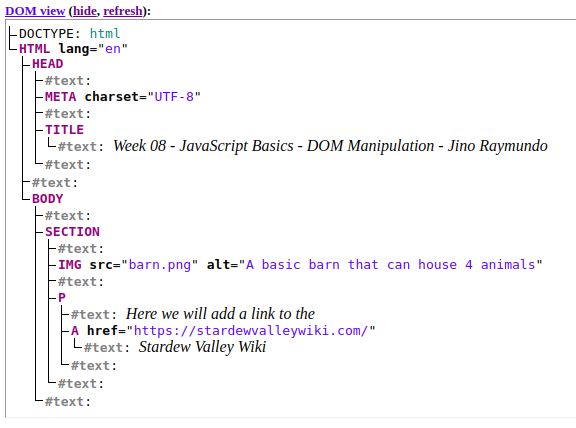

# JavaScript Basics - Manipulating documents

When writing web pages and apps, one of the most common things to do is to somehow change the structure and appearance of a web page.
It could be in the form of adding new `<li>` to a to-do list, changing the text content whenever an item is updated, etc.

> week08\deliverable08\02_dom_manipulation\index.html

> [!IMPORTANT]
> page title: Week 08 - JavaScript Basics - DOM Manipulation - {your name}

```
<!DOCTYPE html>
<html lang="en">
<head>
  <meta charset="UTF-8">
  <title>Week 08 - JavaScript Basics - DOM Manipulation - Jino Raymundo</title>
</head>
<body>
  <section>
    
    <p>
      Here we will add a link to the 
      <a href="https://stardewvalley.net/">Stardew Valley Wiki</a>
    </p>
  </section>
</body>
</html>
```

> copy this html source file and paste unto https://software.hixie.ch/utilities/js/live-dom-viewer/



- **Root node**: The top node in the tree, which in the case of HTML is always the HTML node.
- **Child node**: A node directly inside another node. For example, IMG is a child of SECTION in the above example.
- **Descendant node**: A node anywhere inside another node. For example, IMG is a child of SECTION in the above example, and it is also a descendant. IMG is not a child of BODY, as it is two levels below it in the tree, but it is a descendant of BODY.
- **Parent node**: A node which has another node inside it. For example, BODY is the parent node of SECTION in the above example.
- **Sibling nodes**: Nodes that sit on the same level in the DOM tree. For example, IMG and P are siblings in the above example.

> week08\deliverable08\02_dom_manipulation\script.js

```
const link = document.querySelector("a");
link.textContent = "Stardew Valley Wiki";
link.href = "https://stardewvalleywiki.com";
```

then..

```
const sect = document.querySelector("section");
const para = document.createElement("p");
para.textContent = "We hope you enjoyed the ride.";
sect.appendChild(para);
```

also..

```
const text = document.createTextNode(
  " — the missing manual for Stardew Valley farmers.",
);
const linkPara = document.querySelector("p");
linkPara.appendChild(text);
```

> [!IMPORTANT]
> make sure you add a `<script>` before `</body>`
