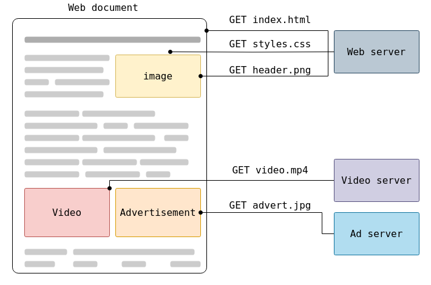
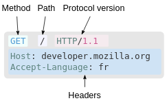

# HTTP

## Overview

HTTP (HyperText Transfer Protocol) is a protocol for fetching resources such as HTML documents. It is the foundation of any data exchange on the Web and it is a client-server protocol,  which means requests are initiated by the recipient, usually the Web browser. A complete document is typically constructed from resources such as text content, layout instructions, images, videos, scripts, and more.



Clients and servers communicate by exchanging individual messages. The messages sent by the client are called **requests** and the messages sent by the server as an answer are called **responses**.

> [!IMPORTANT]
> requests -> sent by the client
> responses -> sent by the server

## Components of HTTP-based systems

HTTP is a client-server protocol: requests are sent by one entity, the **user-agent**. Most of the time the user-agent is a Web browser, but it can be anything, for example, a robot that crawls the Web to populate and maintain a search engine index.

Each individual request is sent to a server, which handles it and provides an answer called the **response**. Between the client and the server there are numerous entities, collectively called **proxies**, which perform different operations and act as gateways or caches, for example.

### Client: the user-agent

The **user-agent** is any tool that acts on behalf of the user. This role is primarily performed by the Web browser, but it may also be performed by programs used by engineers and Web developers to debug their applications.

> [!IMPORTANT]
> The browser is **always** the entity initiating the request.

To display a Web page, the browser sends an original request to fetch the HTML document that represents the page. It then parses this file, making additional requests corresponding to execution scripts, layout information (CSS) to display, and sub-resources contained within the page (usually images and videos). The Web browser then combines these resources to present the complete document, the Web page. Scripts executed by the browser can fetch more resources in later phases and the browser updates the Web page accordingly.

A Web page is a hypertext document. This means some parts of the displayed content are links, which can be activated to fetch a new Web page, allowing the user to direct their user-agent and navigate through the Web. The browser translates these directions into HTTP requests, and further interprets the HTTP responses to present the user with a clear response.

---

### The Web Server

On the opposite side of the communication channel is the **server**, which serves the document as requested by the client. A server appears as only a single machine virtually; but it may actually be a collection of servers sharing the load (load balancing), or other software (such as caches, a database server, or e-commerce servers), totally or partially generating the document on demand.

---

### Proxies

Between the Web browser and the server, numerous computers and machines relay the HTTP messages. Due to the layered structure of the Web stack, most of these operate at the transport, network or physical levels, becoming transparent at the HTTP layer and potentially having a significant impact on performance. Those operating at the application layers are generally called proxies. These can be transparent, forwarding on the requests they receive without altering them in any way, or non-transparent, in which case they will change the request in some way before passing it along to the server. Proxies may perform numerous functions:

- caching
- filtering
- load balancing
- authentication
- logging

---

## HTTP Messages

There are two types of HTTP messages, requests and responses, each with its own format.

### Requests



Requests consist of the following elements:

- HTTP method
- The path of the resource to be fetched
- HTTP version
- Optional headers
- body (sometimes called payload)

---

### Responses

Responses consist of the following elements:

- HTTP method and version
- A Status Code
- A Status Message
- HTTP headers
- body containing the fetched resource

---

## HTTP Request Methods / Verbs

HTTP defines a set of request methods to indicate the purpose of the request and what is expected if the request is successful. Although they can also be nouns, these request methods are sometimes referred to as HTTP verbs. Each request method has its own semantics, but some characteristics are shared across multiple methods, specifically request methods can be **safe**, **idempotent**, or **cacheable**.

Safe
: An HTTP method is safe if it doesn't alter the state of the server. In other words, a method is safe if it leads to a read-only operation.

`GET /customers/profile.html HTTP/1.1`

A call to a safe method, not changing the state of the server


`POST /customers/register.html HTTP/1.1`

A call to a non-safe method, that may change the state of the server


Idempotent
: An HTTP method is idempotent if the intended effect on the server of making a single request is the same as the effect of making several identical requests

> [!NOTE] To be idempotent, only the state of the server is considered. The response returned by each request may differ: for example, the first call of a DELETE will likely return a 200, while successive ones will likely return a 404.

`GET /customers/profile.html HTTP/1.1`

An idempotent method, because it is a safe method. Successive calls may return different data to the client, if the data was somehow modified in between requests

`POST /customers/add-order.html HTTP/1.1`

This is not an idempotent method, because it adds a new order each time it is called

```
DELETE /customers/remove-order/511.html HTTP/1.1 -> returns a 200 upon successful deletion of the order
DELETE /customers/remove-order/511.html HTTP/1.1 -> returns a 404 because the previous request is already deleted
DELETE /customers/remove-order/511.html HTTP/1.1 -> returns a 404 once again
```

These are idempotent requests, even if the returned status code vary between requests

Cacheable
: A cacheable response is an HTTP response that can be cached, that is stored to be retrieved and used later, saving a new request to the server.

---

GET
: The GET method requests a representation of the specified resource. Requests using GET should only retrieve data and should not contain a request content

HEAD
: The HEAD method asks for a response identical to a GET request, but without a response body.

POST
: The POST method submits an entity to the specified resource, often causing a change in state or side effects on the server.

PUT
: The PUT method replaces all current representations of the target resource with the request content.

PATCH
: The PATCH method applies partial modifications to a resource.

DELETE
: The DELETE method deletes the specified resource.

CONNECT
: The CONNECT method establishes a tunnel to the server identified by the target resource.

OPTIONS
: The OPTIONS method describes the communication options for the target resource.

TRACE
: The TRACE method performs a message loop-back test along the path to the target resource

---

## HTTP Common Response Status Codes

HTTP response status codes indicate whether a specific HTTP request has been successfully completed. Responses are grouped in five classes:

1. Informational Responses (100 - 199)
2. Successful responses (200 - 299)
3. Redirection Messages (300 - 399)
4. Client error responses (400 - 499)
5. Server error responses (500 - 599)

---

### 2xx (Successful Responses)

200 OK
: The request succeeded

201 Created
: The request succeeded, and a new resource was created as a result

---

### 3xx (Redirection Messages)

301 Moved Permanently 
: The URL of the requested resource has been changed permanently. The new URL is given in the response.

302 Found
: This response code means that the URI of requested resource has been changed temporarily. Further changes in the URI might be made in the future, so the same URI should be used by the client in future requests.

---

### 4xx (Client error responses)

400 Bad Request
: The server cannot or will not process the request due to something that is perceived to be a client error 

401 Unauthorized
: Although the HTTP standard specifies "unauthorized", semantically this response means "unauthenticated". That is, the client must authenticate itself to get the requested response.

403 Forbidden
: The client does not have access rights to the content; that is, it is unauthorized, so the server is refusing to give the requested resource. Unlike 401 Unauthorized, the client's identity is known to the server.

404 Not Found
: The server cannot find the requested resource. In the browser, this means the URL is not recognized. In an API, this can also mean that the endpoint is valid but the resource itself does not exist.

---

### 5xx (Server error responses)

500 Internal Server Error
: The server has encountered a situation it does not know how to handle. This error is generic

503 Service Unavailable
: The server is not ready to handle the request. Common causes are a server that is down for maintenance or that is overloaded.

---